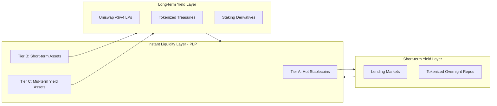

# Pathfinder Yield Stack & Liquidity Pool  
**Architecture & Mechanics**

## 1. Introduction
Pathfinder is a **Unified Yield Layer** that turns *all* idle assets — cash, stablecoins, treasuries, crypto, and tokenized RWAs — into continuously productive capital without compromising on user experience. Whether assets are in a brokerage account, a fintech wallet, or a DeFi protocol, Pathfinder routes them into optimal strategies while keeping liquidity instantly available when needed.

The **Pathfinder Yield Stack** combines:  
- **Instant Liquidity Layer** (Pathfinder Liquidity Pool) for same-block withdrawals and transaction settlement.  
- **Short-term Yield Layer** for daily-to-weekly duration assets that still earn competitive returns while remaining easily callable.  
- **Long-term Yield Layer** for higher-return strategies that require more time to unwind (Uniswap LPs, treasuries, staking).  

The Liquidity Pool is the “tip of the spear” for user-facing flows, but its strength comes from being backed by — and integrated into — the broader Pathfinder stack.

---

## 2. Problem
Idle balances represent a multi-trillion-dollar opportunity, but existing solutions force a trade-off:  
- Keep funds liquid and forfeit yield.  
- Deploy funds for yield and forfeit instant access.  

Institutions and platforms face compounding challenges:  
1. **Lost Revenue** — billions in yield left on the table when user cash sits idle.  
2. **Competitive Threat** — rivals like Coinbase and fintech challengers offering higher yields.  
3. **User Expectations** — instant access to funds is non-negotiable for both retail and institutional clients.  
4. **Fee Sensitivity** — active, high-volume users will switch platforms over small differences in transaction cost.  

Without a unified system for yield + instant access, platforms are forced to choose between **user retention** and **revenue retention**.

---

## 3. Solution
Pathfinder removes the trade-off by embedding yield at **every layer of the liquidity spectrum**:  

### 1. **Pathfinder Liquidity Pool (Instant Liquidity Layer)**  
   - Tiered architecture: Tier A (hot stablecoins), Tier B (short-term assets), Tier C (mid-term yield assets).  
   - Synthetic flash-loan IOUs backed by Tier B/C to cover large withdrawals without breaking yield positions.  
   - Dynamic allocator keeps LP yields at target (8–10%) while holding per-borrow fees below user thresholds (≤10bps).  

### 2. **Yield Routing Engine (Short & Long-term Layers)**  
   - Continuous optimization across lending markets, LP positions, tokenized treasuries, and staking.  
   - Duration-aware: strategies selected based on liquidity horizon and yield potential.  
   - Assets can move between layers to match changing user demand or market conditions.  

### 3. **Fee & Incentive Alignment**  
   - VIP fee tiers and rebates for high-volume users.  
   - Direct pool participation for institutions — they earn yield on capital they provide for instant liquidity.  

The result: **outsized total yield** on all idle assets, with the speed and flexibility to match any user’s liquidity needs — from same-block withdrawal to multi-month investment.

---

## 4. Pathfinder Yield Stack Diagram


---

## 5. Pathfinder Liquidity Pool — Technical Detail

### Liquidity Tiers
| Tier | Liquidity Time | Example Assets | Role in Pool |
|------|----------------|----------------|--------------|
| **A — Immediate** | < 1 block | Hot wallet USDC, same-chain CCT yield tokens | Covers 100% of expected instantaneous withdrawals |
| **B — Short-term** | < 1 day | On-chain lending positions, tokenized overnight repos | Backstop for large withdrawals, low unwind risk |
| **C — Mid-term** | 1–7 days | Uniswap v3/v4 LPs, tokenized treasuries, staking derivatives | Collateral for synthetic IOUs, higher yield |

---

### Synthetic Flash-Loan IOUs
When Tier A liquidity is insufficient for a given draw:
1. **Synthetic credit** is issued to the PLP, collateralized by Tier B/C assets.
2. Credit is repaid as positions unwind or new deposits arrive.
3. Underlying assets may continue earning yield during IOU periods.
4. Accounting is on-chain and auditable.

**Benefits:**
- Smaller Tier A footprint while guaranteeing instant liquidity.
- “Stacked yield” — fees + underlying asset yield.
- Efficient capital reuse across Pathfinder architecture.

---

### Dynamic Pool Sizing
The allocator adjusts pool size **weekly** (or more often) based on:
- Transaction frequency and borrow size.
- VIP fee caps and utilization thresholds.
- Available synthetic capacity from Tier B/C.

**Core Formulae:**
```
F_annual = Y_target / U_target
F_per_borrow = (F_annual / turnover_per_year) * 10,000
Coverage Floor = safety_factor × peak_fraction_of_weekly_volume
```

Allocator Logic:
1. Estimate **weekly borrow demand**.
2. Target utilization (e.g., 75%).
3. If **per-borrow bps > cap**, shrink pool to raise turnover.
4. If **per-borrow bps ≪ cap** and utilization is low, grow pool.
5. Maintain a **coverage floor**.
6. Include synthetic capacity in available liquidity calculations.

---

### User Fee Management
- **Fee Caps:** Default ≤ 10 bps (goal: ≤ 5 bps for HNW/institutional).
- **VIP Rebates:** Volume-based rebate tiers.
- **VIP Pool Participation:** High-volume users can contribute capital to PLP for a larger LP yield share.

**Example VIP Fee Schedule:**
| Tier | Monthly Borrow Volume | Fee (bps) | Rebate % | Effective Fee (bps) |
|------|-----------------------|-----------|----------|----------------------|
| Standard | $0–$5M  | 10  | 0%   | 10  |
| Silver   | $5–$25M | 8   | 20%  | 6.4 |
| Gold     | $25M+   | 5   | 50%  | 2.5 |

---

### LP Yield Composition
LP yield sources:
1. **Fee Yield:** Instant liquidity fees × utilization × turnover.
2. **Portfolio Yield:** Yield from Tier B/C collateral backing synthetic IOUs.
3. **Passive Yield:** Yield on idle LP funds outside the PLP.

---

### Risk Management
- **Liquidity Coverage Ratio (LCR):** Weighted by unwind times.
- **Stress Testing:** Model 3× peak draw and 2× tx/day spikes.
- **Synthetic IOU Limits:** Max % of Tier B/C pledgable.
- **Circuit Breaker:** Halt expansion if coverage risk exceeds threshold.

---

### Monitoring & Telemetry
Allocator decisions are driven by:
- Tx frequency distribution
- Peak concurrent borrow % of weekly volume
- Pool turnover
- Per-borrow bps (raw & VIP effective)
- LP yield actual vs. target

---

## 6. Future Extensions
- Cross-pool lending between institutions.
- ML-driven allocator for liquidity spike prediction.
- Per-cohort fee optimization (retail, HNW, institutional pools).
